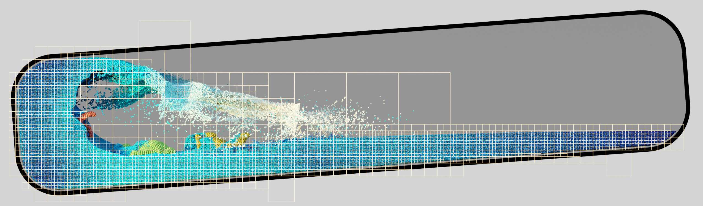

# TreeNSearch
<p align=center>
 
</p>

**TreeNSearch** is a C++ library for fast computation of neighbor lists in point clouds.
It implements the method described in our paper *Fast Octree Neighborhood Search for SPH Simulations*.
However, TreeNSearch can be used for any type of point clouds, not just particle data from fluid simulations.
What makes TreeNSearch faster than previous methods is that it employs an adaptive acceleration structure that can utilize the CPU more efficiently.
TreeNSearch is used in the popular fluid simulation software [SPlisHSPlasH](https://github.com/InteractiveComputerGraphics/SPlisHSPlasH).

All the internal stages of TreeNSearch are available in two versions, one using scalar instructions and another using AVX2 SIMD instructions.
Both implementations are 100% interchangeable.
This makes TreeNSearch a great learning material for SIMD implementation of complex data structures and algorithms.

**Main features:**
* Supports both fixed search radius and variable per-point search radius.
* Multiple point sets with arbitrary active/inactive searches between them.
* Very fast approximate reordering of arbitrary user data related to the points according to a space-filling Z curve to improve the cache efficiency.

**Paper:** [Fast Octree Neighborhood Search for SPH Simulations](https://animation.rwth-aachen.de/publication/0579/)

**Experiments video:** [Video](https://youtu.be/3MYgOasyhnk)

**License**: MIT


## Build Instructions
You can use [CMake](https://cmake.org/) to build this project.
Follow these steps to integrate the TreeNSearch library into another CMake project:
* Copy the `TreeNSearch` folder into the folder structure of your project. There is no need to include `tests` nor the top level `CMakeLists.txt` file.
* In all libraries and executables using TreeNSearch:
    * Make sure to add `TreeNSearch/include` to the include directories.
    * Link against `TreeNSearch`.


## Examples
### Simple full example
Simplest example for TreeNSearch: one point set, all the points have the same search radius.
```c++
// Data types. (Unintiallized for illustration purposes)
float search_radius;
std::vector<std::array<float, 3>> points;

// TreeNSearch default set up
tns::TreeNSearch nsearch;
nsearch.set_search_radius(search_radius);
const int set_0 = nsearch.add_point_set(points[0].data(), points.size());
nsearch.set_active_search(set_0, set_0);  // points in set_0 searches for neighbors in set_0

// TreeNSearch execution
nsearch.run();

// Typical use: traverse the neighbors of point i
const tns::NeighborList neighborlist = nsearch.get_neighborlist(set_0, set_0, i);
for (int loc_j = 0; loc_j < neighborlist.size(); loc_j++) {
    const int j = neighborlist[loc_j];
    // ...
}
```
To execute the neighborhood search again after points have moved, simply use `nsearch.run()` again and the next traversals will be updated.
If the number of points or the pointer to the point coordinate changes, use `nsearch.resize_point_set(set_id, points_ptr, n_points)`.

**Important:** Points are not included in their own neighbor list.


### Multiple sets
It is also possible to work with more sets and arbitrary searches between them:
```c++
const int set_0 = nsearch.add_point_set(points_0[0].data(), points_0.size());
const int set_1 = nsearch.add_point_set(points_1[0].data(), points_1.size());

nsearch.set_active_search(set_0, set_0); // Points in set_0 search for neighbors in set_0
nsearch.set_active_search(set_0, set_1); // Points in set_0 search for neighbors in set_1
```
In the above example, points in `set_1` do not search for neighbors in `set_1`.


### Variable search radii
To work with variable per-point search radius, we can simply include a pointer search radii array in the point set declaration:
```c++
// Data types. (Unintiallized for illustration purposes)
float search_radius;
std::vector<std::array<float, 3>> points;
std::vector<float> radii;

// TreeNSearch default set up for variable search radii
tns::TreeNSearch nsearch;
const int set_0 = nsearch.add_point_set(points[0].data(), radii.data(), points.size());
nsearch.set_symmetric_search(); // Optional: i is in the neighbor list of j if j is neighbor of i
```
**Warning:** It is not possible to have sets with variable search radii and sets with fixed search radii at the same time.
If a single point set has variable search radii, all sets must be declared as such.


### Sorting to a space filling Z curve
In SPH simulations typically point data is kept approximately sorted to improve performance due to better cache utilization.
An explicit sort is often done every few time steps.
TreeNSearch can take advantage of its internal data structure to provide a very fast approximate sort.
You can sort any data as follows:
```c++
// Data types. (Unintiallized for illustration purposes)
std::vector<std::array<float, 3>> points;
std::vector<double> density;
std::vector<uint32_t> indices;

// Sorting
nsearch.prepare_zsort();
nsearch.apply_zsort(set_id, points[0].data(), 3);
nsearch.apply_zsort(set_id, density.data(), 1);
nsearch.apply_zsort(set_id, indices.data(), 1);
```

### Convenient iteration over the neighbors
TreeNSearch offers the possibility to traverse a neighbor list by using a templated callback function, replacing the following code
```c++
const tns::NeighborList neighborlist = nsearch.get_neighborlist(set_i, set_j, i);
for (int loc_j = 0; loc_j < neighborlist.size(); loc_j++) {
    const int j = neighborlist[loc_j];
    // ...
}
```
with this one
```c++
nsearch.for_each_neighbor(set_i, set_j, i,
    [&](const int j) {
        // ...
    }
);
```
Both versions should have identical runtime performance assuming the compiler inlines the templated callback function.


## Limitations
* Currently, TreeNSearch has a maximum domain extent of 2^16 cells per dimension in its internal grid representation.
If the extent of all the point sets exceeds this limitation, TreeNSearch will terminate with an error.
For reference, this is enough space to concatenate more than 200 SPH simulations of the Beach Scene with 9M particles as seen in the original [paper](https://animation.rwth-aachen.de/publication/0579/).
* There is a hard limit on how many neighbors a given point can have due to the internal neighbor list storage data structure.
The limit is set by default at 2^18 (262,144) neighbors (1MB worth of int32_t).
While most applications will not experience this limitation

Even though most applications will not suffer from these limitations, we are currently working on handling those extreme cases.


## Notes
* TreeNSeach is optimized to be run many times as points move very little between runs, which is the typical case for time evolving SPH simulations.
You might find that TreeNSeach is not the fastest solution for you if your problem doesn't fit to this description.
* TreeNSearch works with type `float` internally, which is faster than `double` for the neighborhood search problem.
While faster, it has the downside that it will misclassify points as neighbors when they are at approximately search radius distance.
As consequence, there might be some points found as neighbors by TreeNSearch that would be not classified as neighbor in later processing if carried out in `double` precision.
The misclasification tolerance is the machine precision value of `float`, ~5.96e-08.
